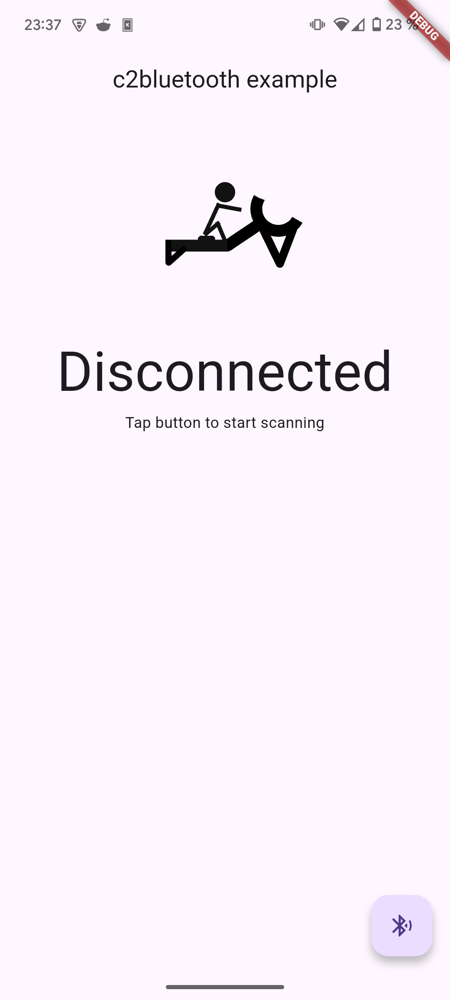
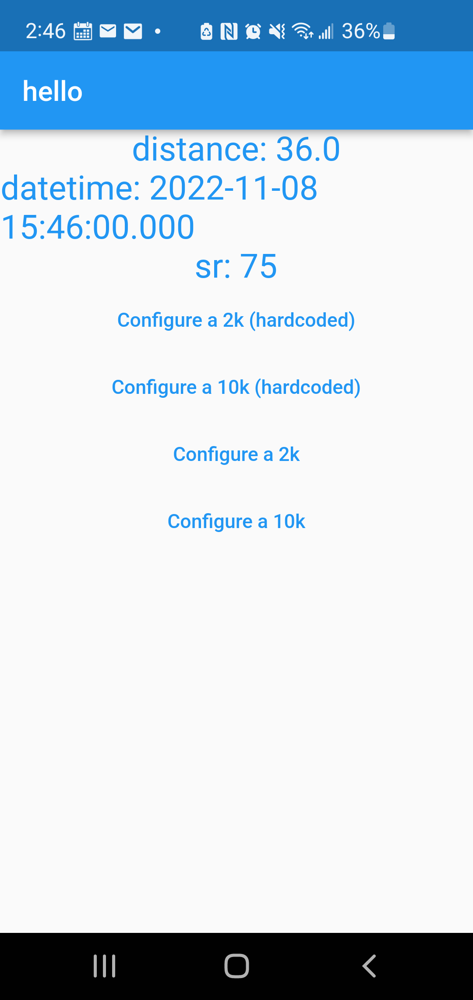

# c2bluetooth_example

This is a sample app created from a fresh flutter project it is useful as a playground for experimenting with/testing the c2bluetooth library as it is being built as well as providing an example for how this could be used in an app

Currently this app just connects to the first erg that it sees. An update is planned to make this a little more user-friendly for testing in environments with many ergs.

<!-- 

This is a relatively old screenshot of the included example app using an older version of the library to display the completed distance from a short 20-second test workout. Many improvements to expose more datapoints have been made since this screenshot was taken. -->

## Sample App capabilities
### Get workout summary information

1. build and install the example app for your platform.
2. confirm bluetooth is on.
3. Accept any permission prompts you are given
4. turn on PM and go to the screen where you would connect something like the ergdata app (on newer firmware there will be a connect button on the main menu)
5. open/run the app. you should see a screen with a "Start scan" button. 
6. Press this "start scan" button when you are ready to start scanning for ergs. You will see a few messages on the screen while it scans. Wait until the app says "setting up streams".
7. Use the back button on the erg to go back and set up a piece. A 20 sec (minimum allowed) single time piece is the shortest thing you can do that still works (just row pieces must be longer than 1 minute in order to be visible to the app and be saved in the PM's memory).
8. start the piece. after the piece is over you should see some data for the piece you completed appear on screen. 
9. you are now ready to start making changes to the sample app to play around with the API and explore  the other data points that are made available.

